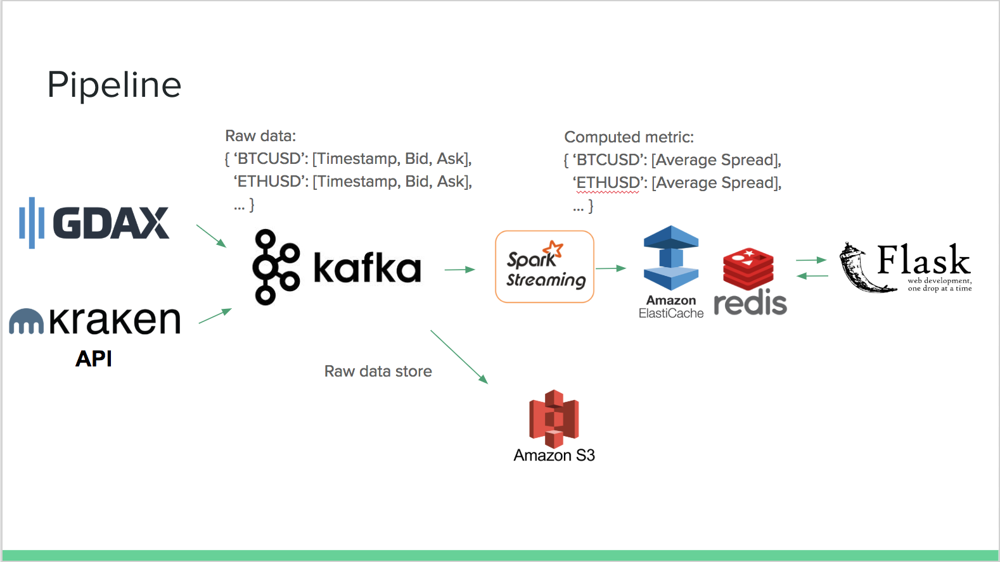
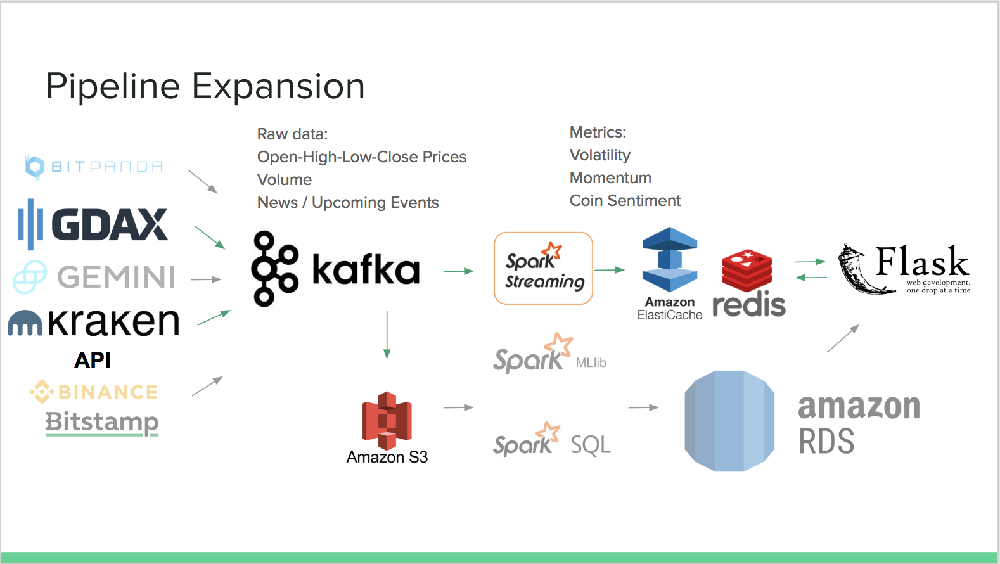

# crypto-pipeline

Cryptocurrency pipeline for making data-driven investing decisions by ingesting crypto data, computing various metrics that can be correlated with price movements in near real-time, and combined for increased accuracy.

The first iteration is a live dashboard of coins with one metric processed, the bid-ask spread of a list of coins and its last rolling 15s average. Often with less frequently traded alt-coins, they have higher spreads and require a crypto-to-crypto exchange such as Binance where you convert a more popular coin to obtain it, and people lose money when placing market orders in these situations to the exchange. By monitoring the average, one can apply reversion to the mean to determine a more apt limit order to place. On a lot of exchanges, limit orders also tend to have lower fees as maker orders versus taker orders.

Other metrics that can be added to the system easily at scale include measures of volatilty (such as standard deviations in Bollinger bands, or the ATR), momentum (RSI to help prevent buying at a top or selling at a low), as well as trends (moving averages). Event data such as news around cryptocurrency and specific coins can be ingested and processed as well. Other features can be developed from the raw data that is stored in S3 for machine learning models. A different UI could be developed for the pipeline.

## Pipeline
The existing pipeline ingests from two data providers, GDAX and Kraken into Kafka where topics are by {exchange}_{metric} and partitions are by coin for parallelized, ordered processing at high throughput. It is consumed for storage in S3 for longer-term historical batch processing, and by Spark Streaming where multiple workers compute a rolling average. This is stored in an Elasticache cluster with Redis replicated to provide quick in-memory read access by the Flask application.

### Challenges
Challenges faced involved integrating with multiple data providers, extracting data from their APIs and transforming them to the same format for load into Kafka.

Kafka design also involved deciding how to choose topics and parallelize the ingestion. Coins can be separated to different partitions as we only need to maintain ordering per coin, and each partition would be linked to a Spark worker. As the number of coins increase, we want to watch our number of partitions as Kafka's replication would slow down writes to be consumed, and so more than one coin can be hashed to a partition.

In Spark, we need to ensure efficiency in our transformations. In our MapReduce example, groupByKey would not add up counts first on the worker nodes, whereas reduceByKey does, thus reducing the network load of data sent back to the Spark Driver. We also employ an RDD cache() on the windowed DStream when two kinds of transformation processes need to be performed on the data.

## Expanded Pipeline
This is a diagram demonstrating potential expansion to this pipeline. The data in S3 is a source for new feature development for ML models in Spark ML, as well as for longer-term historical processing with Spark SQL Dataframes. A permanent database store such as RDS can be used if we also expect transactional data operations from our Flask app, or Cassandra otherwise for fast high writes.

